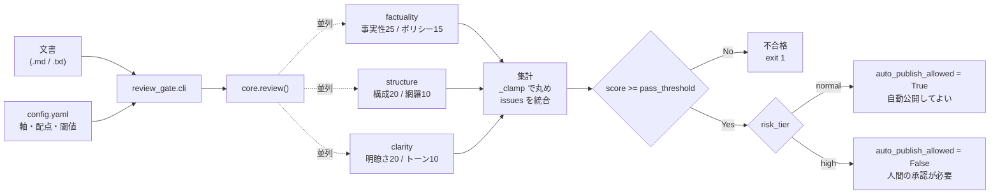

# ai-review-gate

**AI生成文書を「そのまま公開してよいか」判定する、マルチレビュアー品質ゲート。**
AI記事を自動生成・自動公開するパイプラインを運用する人のための、CIから呼べるCLIです。
担当軸を絞った専門レビュアーを並列に走らせて採点し、**リスクティアの高い文書は満点でも自動公開させません**（この契約はテストで固定してあります）。

実運用中のコンテンツ自動生成パイプラインから、品質ゲート部分だけを汎用化して切り出したものです。

- 実行時に import するのは `google-genai` / `tenacity` / `PyYAML` の3つだけ。フレームワークもDBも使いません
- 評価軸・配点・合格閾値は `config.yaml` で定義。**軸を足すのはプロンプト1枚とYAML数行**
- テストはAPIキー不要で全件動きます（`MockLLMClient` で完結）

---

## 目次

- [課題と解決](#課題と解決)
- [パターンの要点](#パターンの要点)
- [アーキテクチャ](#アーキテクチャ)
- [セットアップ](#セットアップ)
- [使い方](#使い方)
- [設定項目](#設定項目)
- [レビュアーの契約](#レビュアーの契約)
- [出力JSON](#出力json)
- [カスタマイズ](#カスタマイズ)
- [テスト](#テスト)
- [設計判断とその理由](#設計判断とその理由)
- [スコープ外・制限](#スコープ外制限)

---

## 課題と解決

AIに記事を書かせて自動公開する仕組みを作ると、次の3つが必ず問題になります。

| 課題 | このリポジトリでの解決 |
| --- | --- |
| **1つのプロンプトに全部見せると点が甘くなる。** 「事実性も構成も文章も見て100点満点で採点して」と頼むと、評価が総花的になり、どの記事も80点前後に収束して差が出ない | **担当軸を絞った専門レビュアーへ分割**し、`ThreadPoolExecutor` で並列実行して集計する。分割してもレイテンシは増えない |
| **書いたモデルに採点させても、自分の癖は減点できない。** 冗長な言い回しも、根拠の薄い断定も、同じモデルは「自然な文章」と判定する | **執筆モデルとレビューモデルを別系統にする**（例: 執筆Claude / レビューGemini）。このリポジトリはレビュー側だけを担当する |
| **「高リスクな記事は人が確認してから公開する」という運用ルールは、いつか破られる。** 忙しい日・引き継ぎ・自動実行の追加で、心がけは機能しなくなる | **ゲートをコードに実装する。** `risk_tier: high` は合格しても `auto_publish_allowed` が `False` のまま。テストで固定してあり、壊す変更はマージできない |

---

## パターンの要点

### 1. 専門分業レビュー（1万能レビュアーより3専門レビュアー）

1つのプロンプトに全評価軸を任せると、評価が総花的になり点数が甘くなります。
「事実性」「構成」「文章品質」のように担当軸を絞ったレビュアーへ分割し、
`ThreadPoolExecutor` で並列実行して集計します。分割してもレイテンシは増えません。

各レビュアーは**自分の担当軸の点数しか返しません**（`ReviewerSpec.axes` が契約）。
他の軸の点を返してきても、集計時に無視されます。

### 2. 執筆モデルとレビューモデルを分ける

同じモデルに書かせて採点させると、自分の癖を減点できません。
執筆をClaude、レビューをGeminiのように**別系統のモデル**にすることで監査の客観性を確保します。

### 3. ゲートはコードに実装する（運用の心がけにしない）

```python
# high は合格しても自動公開させない。この行がゲートの本体。
auto_publish_allowed = passed and risk_tier == "normal"
```

法令・医療・金融など影響の大きい文書（`risk_tier: high`）は、**満点でも自動公開されません**。
公開には必ず人間の承認操作が必要です。この契約はテストで固定してあり、
`test_高リスクは合格しても自動公開不可` が落ちる変更はマージできません。

### 4. LLMの応答を信用しない集計

- 応答からJSONを抽出（コードフェンス・前置き付きでも取り出す。無ければ `ValueError`）
- 配点上限を超えた点・数値でない値は `_clamp` で丸め、集計を壊さない
- 503（過負荷）のみ指数バックオフで再試行し、4xxは即座に失敗させる

---

## アーキテクチャ

### 処理の流れ



### ディレクトリ構成

```
ai-review-gate/
├── review_gate/
│   ├── core.py      # レビュアーの並列実行・集計・ゲート判定（このリポジトリの本体）
│   ├── llm.py       # LLMクライアント抽象／Gemini実装／JSON抽出／テスト用モック
│   └── cli.py       # CLIエントリポイント。不合格を終了コード1で返す
├── prompts/
│   ├── factuality.md  # 事実性・ポリシー適合性レビュアー
│   ├── structure.md   # 構成レビュアー
│   └── clarity.md     # 文章品質レビュアー
├── tests/
│   └── test_core.py   # ゲートの契約を固定するテスト（8件）
├── config.yaml        # 軸・配点・合格閾値・既定リスクティア
└── requirements.txt
```

### モジュールの責務

| モジュール | 責務 | 外に出さないもの |
| --- | --- | --- |
| `core.py` | レビュアー定義（`ReviewerSpec`）、並列実行、集計、ゲート判定、レポート整形、結果保存 | プロバイダ固有のSDK・モデル名を一切参照しない |
| `llm.py` | `LLMClient` 抽象、`GeminiClient`、`MockLLMClient`、`extract_json` | Gemini SDK と `tenacity` はここでだけ import（しかも遅延import） |
| `cli.py` | 引数解釈、`config.yaml` 読み込み、実行、表示・保存、終了コード | ロジックを持たない |

`core.py` は `LLMClient` 抽象にしか依存しないため、**テストは実APIを叩かずに全ケースを再現できます。**

---

## セットアップ

動作確認: Python 3.14.3（テスト8件すべて通過）。全モジュールで `from __future__ import annotations` を使っているため、型注記由来のバージョン制約はありません。

```bash
git clone https://github.com/akiijauto/ai-review-gate.git
cd ai-review-gate

python -m venv .venv
source .venv/bin/activate        # Windows: .venv\Scripts\activate
pip install -r requirements.txt
```

APIキーは環境変数から読み込まれます（`GeminiClient` は `genai.Client()` を引数なしで生成します）。

```bash
cp .env.example .env             # GOOGLE_API_KEY を記入

# あるいは直接渡す
export GOOGLE_API_KEY="your_key"
```

> **テストだけ動かすならAPIキーは不要です。** `google-genai` と `tenacity` を入れていなくても `pytest` は通ります
> （どちらも `GeminiClient.__init__` の中で遅延importしているため）。

---

## 使い方

```bash
# 既定のリスクティア（config.yaml の default_risk_tier）で判定する
python -m review_gate.cli 記事.md

# 高リスク文書として判定する（合格しても自動公開は不可になる）
python -m review_gate.cli 記事.md --risk-tier high

# 結果をJSONで保存する（親ディレクトリは自動作成される）
python -m review_gate.cli 記事.md --out reviews/記事.review.json

# 別の設定ファイルを使う（プロンプトのパスはその設定ファイルからの相対で解決される）
python -m review_gate.cli 記事.md --config configs/medical.yaml
```

### CLIオプション

| オプション | 既定値 | 説明 |
| --- | --- | --- |
| `document`（必須） | — | レビュー対象の文書ファイル（UTF-8） |
| `--config` | リポジトリ直下の `config.yaml` | 軸・配点・閾値の定義ファイル |
| `--risk-tier` | `config.yaml` の `default_risk_tier` | `normal` または `high` |
| `--out` | 保存しない | 結果JSONの保存先パス |

### 出力例

```
総合: 84/100点 (合格)
自動公開: 可
内訳: factuality:22 policy:13 structure:17 coverage:8 clarity:16 tone:8
指摘:
  - 第2段落の統計に出典がない
```

`--risk-tier high` を付けると、同じ84点でも次のようになります。

```
総合: 84/100点 (合格)
自動公開: 不可（人間の承認が必要）
```

### 終了コード

| コード | 意味 |
| --- | --- |
| `0` | 合格（`score >= pass_threshold`） |
| `1` | 不合格 |

不合格が終了コード1で返るため、CIのゲートにそのまま置けます。

```yaml
# GitHub Actions の例
- name: 品質ゲート
  env:
    GOOGLE_API_KEY: ${{ secrets.GOOGLE_API_KEY }}
  run: python -m review_gate.cli articles/draft.md --out reviews/draft.json
```

> **注意**: 終了コードは「合格したか」だけを表します。
> 自動公開してよいかどうかは `auto_publish_allowed` を見てください（高リスクは合格でも `false`）。

---

## 設定項目

### 環境変数

| 変数名 | 必須 | 説明 |
| --- | --- | --- |
| `GOOGLE_API_KEY` | レビュー実行時のみ | Gemini APIキー。`GeminiClient` は `genai.Client()` を引数なしで生成するため、キーは**SDKが環境変数から読み込む**。CLI は起動時に `.env`（実行ディレクトリ → リポジトリ直下の順）を環境変数へ読み込むので、`.env` に書いておけば動く。既に環境変数にある値は上書きしない。テスト実行には不要 |

### config.yaml

```yaml
model: gemini-2.5-flash        # レビュアーが使うモデル
pass_threshold: 80             # 合格点（全軸の合計に対する閾値）
default_risk_tier: normal      # --risk-tier 省略時の既定値

reviewers:
  - name: factuality           # レビュアー名（結果JSONのキーになる）
    prompt: prompts/factuality.md   # config.yaml からの相対パス
    axes:
      - { name: factuality, max: 25 }
      - { name: policy,     max: 15 }
```

| キー | 型 | 説明 |
| --- | --- | --- |
| `model` | string | 使用モデル。省略時は `gemini-2.5-flash` |
| `pass_threshold` | int | 合格点。**満点は `axes` の `max` の総和から自動計算される**ため、軸を足したら閾値も見直すこと |
| `default_risk_tier` | `normal` \| `high` | CLIで指定しなかったときのリスクティア |
| `reviewers[].name` | string | レビュアー名 |
| `reviewers[].prompt` | path | プロンプトファイル。**`config.yaml` の位置を基準に解決される**（実行時のカレントディレクトリに依存しない） |
| `reviewers[].axes[].name` | string | 軸名。集計の内訳キーになる |
| `reviewers[].axes[].max` | int | その軸の配点上限。モデルがこれを超える点を返しても `_clamp` で丸められる |

同梱の `config.yaml` は 6軸・満点100点・合格80点の構成です（事実性25 / ポリシー15 / 構成20 / 網羅10 / 明瞭さ20 / トーン10）。

### 動作パラメータ（コード内の既定値）

| 項目 | 値 | 場所 |
| --- | --- | --- |
| 並列数 | `max_workers=3` | `core.review()` の引数 |
| 再試行対象 | **503（`ServerError` かつ `code == 503`）のみ** | `GeminiClient._is_retryable` |
| 再試行の待ち | 指数バックオフ 10秒〜80秒、最大4回、最後は再送出 | `GeminiClient.generate_json` |

---

## レビュアーの契約

各レビュアーのプロンプトは、`{document}` プレースホルダを1つ持つMarkdownファイルです
（`str.format` で埋め込むため、**出力例のJSONは `{{` `}}` でエスケープします**）。

```markdown
あなたは文書の「事実性・ポリシー適合性」専門レビュアーです。担当軸のみ評価してください。

# 評価対象
---
{document}
---

# 評価軸
- factuality (0-25): 事実の正確さ。根拠のない断定・古い情報・誇張を減点
- policy (0-15): 断定的な効果保証・法令に触れうる表現・出典なしの統計を減点

# 出力形式（JSONのみ）
{{"factuality": 0, "policy": 0, "issues": ["具体的な指摘を1件1文で"]}}
```

モデルに期待する応答:

| キー | 型 | 扱い |
| --- | --- | --- |
| 各軸名（例 `factuality`） | int | `0` 〜 その軸の `max` に丸める。欠けていれば0点 |
| `issues` | string[] | 全レビュアー分を連結して指摘一覧にする。配列でなければ無視する |

**モデルは指示どおりに返さない前提で書いてあります。** コードフェンスや前置きが付いた応答でも
最初のJSONオブジェクトを抽出し、抽出できない場合は `ValueError` にして上流が再生成を判断できるようにします。

---

## 出力JSON

`--out` を指定したときに保存される形式です。

```json
{
  "score": 84,
  "max_score": 100,
  "breakdown": { "factuality": 22, "policy": 13, "structure": 17, "coverage": 8, "clarity": 16, "tone": 8 },
  "issues": ["第2段落の統計に出典がない"],
  "passed": true,
  "auto_publish_allowed": true,
  "per_reviewer": {
    "factuality": { "factuality": 22, "policy": 13, "issues": ["第2段落の統計に出典がない"] }
  }
}
```

| フィールド | 説明 |
| --- | --- |
| `score` / `max_score` | 合計点と満点（満点は `config.yaml` の配点から計算） |
| `breakdown` | 軸ごとの点数（丸め後） |
| `issues` | 全レビュアーの指摘を連結したもの |
| `passed` | `score >= pass_threshold` |
| `auto_publish_allowed` | **`passed` かつ `risk_tier == "normal"`。公開判定はここを見る** |
| `per_reviewer` | 各レビュアーの生応答。あとから軸の配点を見直すときの一次資料になる |

---

## カスタマイズ

### 評価軸を足す

1. `prompts/` にプロンプトを1枚追加する（`{document}` を含める）
2. `config.yaml` の `reviewers` に定義を追記する
3. `pass_threshold` を新しい満点に合わせて見直す

```yaml
  - name: seo
    prompt: prompts/seo.md
    axes:
      - { name: seo, max: 20 }
```

コードの変更は不要です。並列数は `core.review()` の `max_workers`（既定3）で、レビュアーを増やすときは合わせて調整します。

### 別のLLMに差し替える

`llm.LLMClient` を継承して `generate_json` を実装し、`cli.py` で差し替えます。
`core.py` はモデル名もSDKも知らないため、**core側の変更は不要**です。

```python
class MyClient(LLMClient):
    def generate_json(self, prompt: str) -> dict:
        ...  # 応答テキストを extract_json に通して返す
```

---

## テスト

```bash
pytest
```

```
........                                                   [100%]
8 passed in 0.47s
```

APIキー不要で全テストが動きます（`MockLLMClient` で完結）。ネットワークにも一切アクセスしません。

固定している契約:

| テスト | 何を保証するか |
| --- | --- |
| `test_合格_集計と内訳` | 軸ごとの点を合算し、内訳・満点・合格判定を返す |
| `test_閾値未満は不合格` | 閾値未満は `passed` も `auto_publish_allowed` も `False` |
| **`test_高リスクは合格しても自動公開不可`** | **`risk_tier: high` は満点(100/100)でも `auto_publish_allowed` が `False`** |
| `test_配点上限超過と不正値は集計を壊さない` | `999` → 上限に丸め、`"高い"` や `-5` → 0点。例外を投げない |
| `test_全レビュアーの指摘が集約される` | 複数レビュアーの `issues` が漏れなく連結される |
| `test_未知のrisk_tierは拒否` | `"medium"` のような未知の値は `ValueError`（黙って `normal` 扱いにしない） |
| `TestExtractJson::test_コードフェンス付き応答` | 前置き＋コードフェンス付きでもJSONを取り出せる |
| `TestExtractJson::test_JSONが無い応答はValueError` | 抽出できない応答は例外。空dictでごまかさない |

`MockLLMClient` はプロンプト中のマーカー文字列で応答を切り替えるため、
**「どのレビュアーに何点を返させたか」を明示したままテストが書けます。**
どのマーカーにも一致しないプロンプトが来たら `AssertionError` で落ちます（プロンプト差し替えの取りこぼし検出）。

---

## 設計判断とその理由

| 判断 | 理由 | 代わりに何を捨てたか |
| --- | --- | --- |
| **レビュアーを軸ごとに分割し、並列実行する** | 1プロンプトに全軸を任せると評価が総花的になり点が甘くなる。実運用で確認した挙動 | API呼び出し回数が軸グループの数だけ増える。並列化でレイテンシは吸収した |
| **`auto_publish_allowed` を `passed` と別フィールドにした** | 「合格したか」と「自動公開してよいか」は別の問いだから。ひとつの真偽値にまとめると、高リスクの扱いが呼び出し側の実装に依存してしまう | フィールドが1つ増える |
| **高リスクの禁止をテストで固定した** | ゲートは静かに壊れると誰も気づかない。リファクタで `and risk_tier == "normal"` が消えても、テストが無ければ次の記事が自動公開される | なし |
| **未知の `risk_tier` を `ValueError` にした** | 未知の値を `normal` にフォールバックさせると、タイポ（`"High"` など）が**安全側ではなく危険側に倒れる** | 呼び出し側で値の正規化が必要になる |
| **設定をYAMLに出した** | 軸の追加・配点の見直しは運用中に何度も起きる。そのたびにコードを触るのは事故のもと | YAMLの構造ミスは実行時にしか分からない |
| **プロンプトのパスを `config.yaml` からの相対で解決** | 実行時のカレントディレクトリに依存すると、cron・CIから呼んだときだけ壊れる | 設定ファイルとプロンプトを離れた場所に置けない |
| **`google-genai` と `tenacity` を遅延importにした** | テストがモックで完結するのに、実行にSDKのインストールを要求するのはおかしい。CIのテストジョブが軽くなる | import エラーが実行時まで遅れる |
| **再試行を503だけに限定した** | 4xx（キー誤り・入力不正）は待っても直らない。無条件リトライは**壊れた入力でAPI費用を4倍払う** | 一時的な500系の一部は拾えない |
| **`_clamp` で丸めて集計を続ける** | 1つの軸の異常値でパイプライン全体を止める価値はない。0点として扱えば、閾値判定は自然に安全側（不合格）へ倒れる | モデルの異常出力に気づきにくい（`per_reviewer` に生応答を残して補っている） |
| **JSON抽出失敗だけは例外にした** | 応答全体が壊れているときは「0点」ではなく「測れなかった」が正しい。上流が再生成を選べるようにする | 呼び出し側に例外処理が要る |
| **執筆モデルとレビューモデルを分ける前提にした** | 自己採点はバイアスが避けられない。監査の客観性は構成で担保する | 2系統のAPIキーが必要になる |

---

## スコープ外・制限

- **公開処理そのものは含みません。** このリポジトリは判定までを行い、`auto_publish_allowed` を返します。CMSへの投稿・下書き保存は呼び出し側の責務です
- **スコアの絶対値は校正されていません。** 80点という閾値は、同じ軸定義・同じモデルの下での相対比較として使うことを想定しています。プロンプトやモデルを変えたら閾値も測り直してください
- **1ファイル1回の判定のみ**です。複数記事の一括処理・履歴の保存・レビュー結果の学習は含みません
- 同梱のプロンプトは日本語の記事を想定しています。他言語で使う場合はプロンプトを差し替えてください

---

## ライセンス

MIT License（[LICENSE](LICENSE)）
